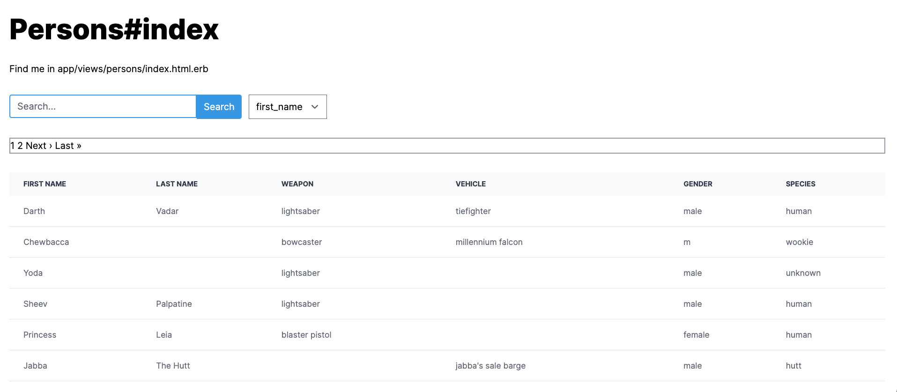

# Run Application
Use docker to easily start the application
```
docker build . -t sentia_rails

docker run -p 3000:3000 sentia_rails
```
Then visit the application at http://localhost:3000

# Description

## Routes
- `/importer/new` - Path where the CSV importer is located
- `/people` - Path that shows the data of the People table
- `/affiliations` - Path that shows Affiliations data
- `/locations` - Path that shows Locations data
- `/motor_admin` - Admin Page from the `moto_admin` gem

## Gems used
- motor admin
- tailwindcss
- pry-rails
- kaminari

## Screenshots
